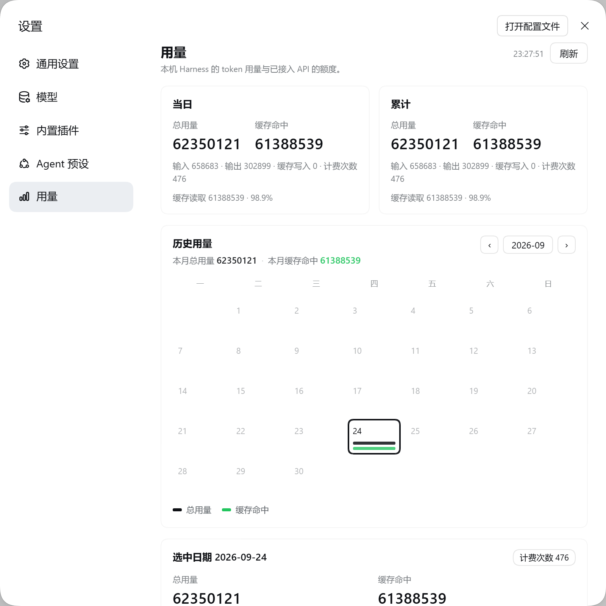
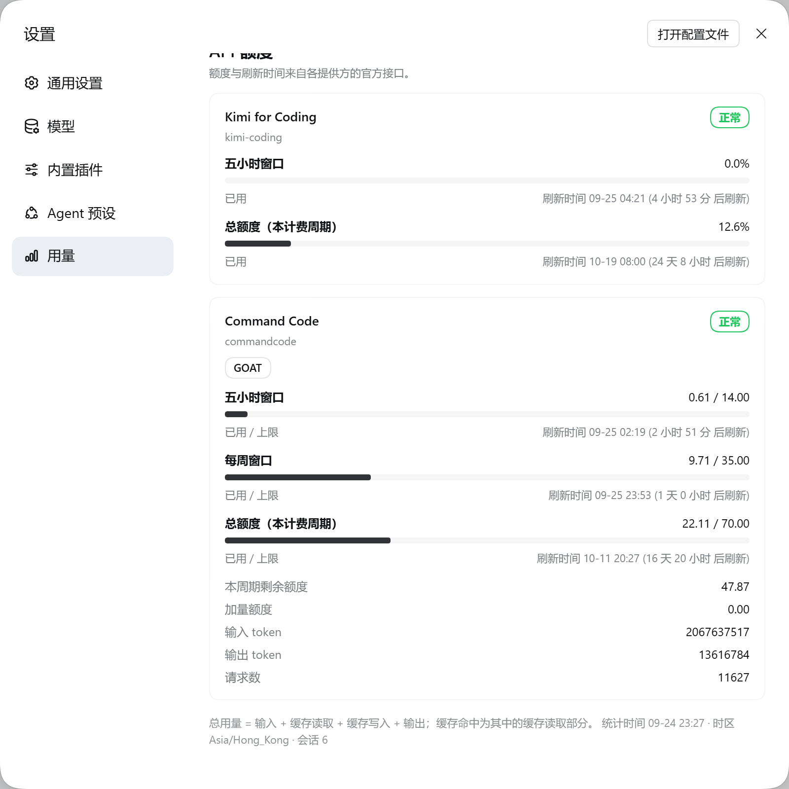
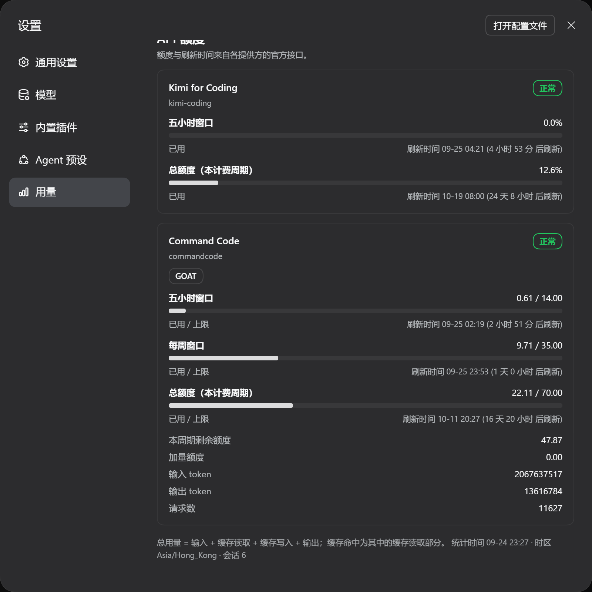

# 用量 · dsh-usage

[中文](README.md) | [English](README.en.md)

> DeepSeek Harness (DSH) 设置面板里的 **用量** 页：当天与累计的 token 用量、缓存命中、
> 历史日历，以及本 Harness 已接入 API 的额度与刷新时间。



插件注册在 `settings.section`，名为「用量」，排在 **Agent 预设** 下面，图标为自绘的三柱折线。

## 安装

这是一个标准的 DSH bundle（`package.json` 里声明了 `dsh.bundle.patch` 与 `dsh.client`）。
把本目录放到任意位置，然后在 DSH 里装进当前 profile：

```text
plugin_manager   action: install_bundle   target: <本目录的绝对路径>
```

它会执行 pnpm 置入并把 `@local/dsh-usage` 写进 profile 的 `dsh.profile.bundles`。
等价的手工方式：

```bash
dsh plugin --profile <你的 profile> add <本目录的绝对路径>
```

装好后 **Host 半需要重启 Harness 才生效**（Host 模块走 Node 的 ESM 缓存，不参与 HMR）；
浏览器半由 HMR 立刻更新。想关掉它，在 profile 自己的 `cordis.patch.yml` 里覆盖这一行：

```yaml
- id: usage-panel
  disabled: true
```

## 它显示什么

| 区块 | 内容 |
|---|---|
| 当日 / 累计 | 总用量、缓存命中，附输入 / 输出 / 缓存写入 / 计费次数明细 |
| 历史用量 | 月历，每天两根按比例的长度条（总用量、缓存命中），点选某天看精确数字；可翻月 |
| API 额度 | `kimi-coding`（五小时窗口、总额度）与 `commandcode`（五小时、每周、总额度）的已用比例与刷新时间 |

用量数字一律以 **完整整数** 显示，不做 `K` / `M` / `B` 之类的缩写。

`commandcode` 的量按 **百分比** 显示，不显示金额：它的每个模型各有自己的金额上限，同一个「还剩多少美元」在不同模型上能干的活并不一样，所以那个数字不可比。可比的只有「这个窗口已经用掉多少比例」，因此面板只报比例。本计费周期的上限由 **已用 + 剩余** 现场推导（对任何套餐都成立），只在接口没给剩余值时回落到公开价目表；`kimi-coding` 原始接口本身就返回比例，照旧。



## 速度

面板从不等人。两个半边的代价差了三个数量级，所以它们是分开请求的：

| 半边 | 实测 |
|---|---|
| 本地折叠（读本机会话日志） | 60 毫秒级 |
| 提供方额度（一次海外往返） | 2 至 8 秒 |

因此：

- 卡片和日历在本地数据到达时就画出来，额度区块自己在后面填；
- 四个提供方请求 **并发** 发出（此前是「kimi 然后 commandcode」两段串行，等于付两次往返）；
- 额度结果按 90 秒新鲜度直接返回，过期时先给旧值再后台更新，页面拿到 `refreshing` 后自行回来取；
- 插件激活 2.5 秒后预热一次缓存，之后每 5 分钟后台刷新，**打开设置通常就是缓存命中**；
- 会话日志按 `revision` 增量折叠：日志只是变长时只读新增的尾部，不重读整份。



## 口径

- 总用量 = 输入 + 缓存读取 + 缓存写入 + 输出，与 `@deepseek-ai/dsh-token-meter` 一致：
  一条计费记录的 `inputTokens` 是 **未命中缓存** 的提示词部分，所以缓存命中不会被重复计算。
- 缓存命中 = 该口径里的缓存读取部分。
- 按天归档使用 **本机时区** 的日历日。
- 数据来源是 Host 的 `sessionPersistence` 服务（不自行解析压缩的会话日志文件）。

## 结构

```
package.json       bundle 清单（dsh.bundle.patch + dsh.client）
cordis.patch.yml   一行 insert：装载 Host 半
index.js           Host 半：/api/usage/usage、/api/usage/quota、/api/usage/report
client.js          浏览器半：settings.section 页面（无构建步骤的懒 CJS bundle）
icon.svg           bundle 图标
locale/*.json      插件清单里的标题与说明
docs/              真实页面截图
test/selfcheck.mjs 激活自检
```

## 隐私

- 提供方密钥只从 Harness 自己的凭据库解析，**始终留在 Host 侧**，浏览器只拿到响应体；
- 额度来自提供方自己的官方接口，不读第三方 CLI 的私有文件、不碰浏览器 Cookie；
- 本仓库不含任何密钥、账号标识或本机路径。

## 自检

```bash
node test/selfcheck.mjs      # 或 pnpm test
```

在 Node 里按插件系统的方式装载两个半边、用桩上下文激活，并离线跑通三条路由，逐项断言：
导出形态、路由形状与路径唯一性、无凭据时的降级响应、token 折叠口径、提供方解析、
四个请求确实并发、本地半边不触碰网络，以及 section 的 id / order / label / 组件类型。
全部通过即退出码 0。

## 致谢

设置左栏「自己画图标并让 shell 的兜底图标让位」这一手法，与 MIT 许可的
[`commandcode-dash`](https://github.com/Momonaka/commandcode-dash) 采用的是同一思路。

## License

[MIT](LICENSE) © linanbuan
